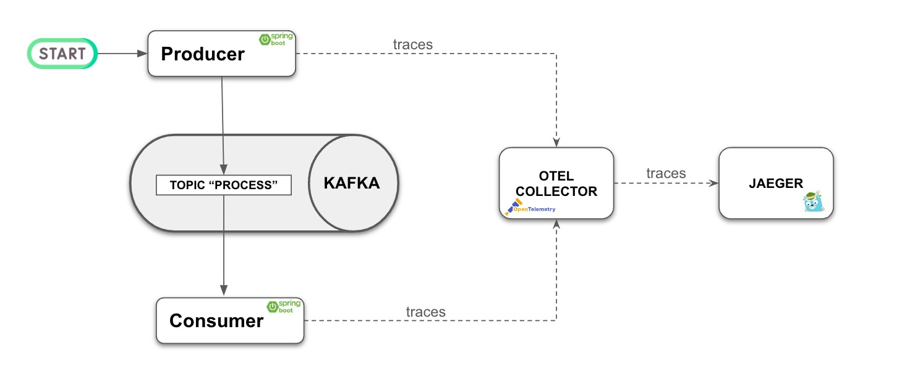
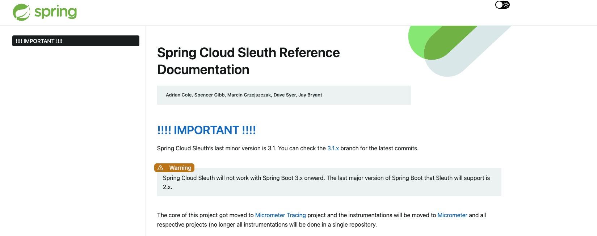
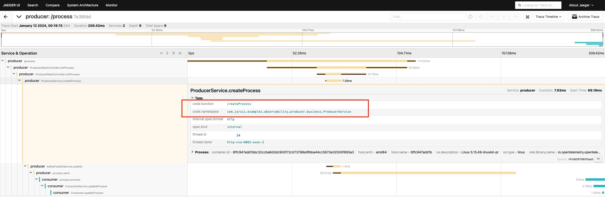
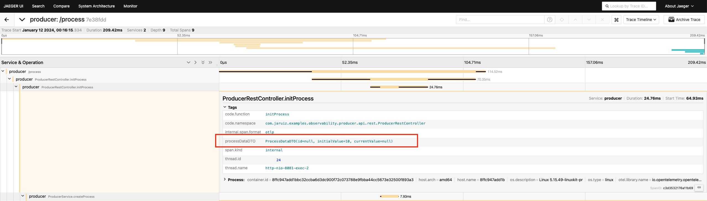
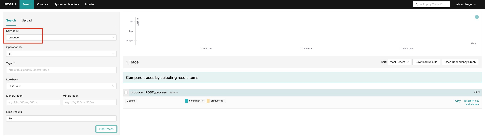
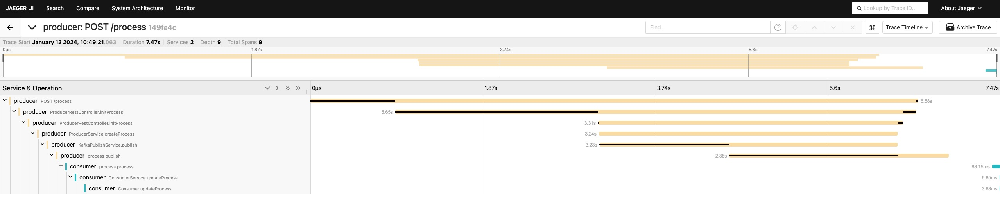

# Spring Boot 3, OpenTelemetry and Jaeger


## Introduction

This repository shows how to add tracing to an Spring Boot 3 application using OpenTelemetry and sending data to Jaeger

This PoCs has the following architecture:



There are two services, one of them (the producer) produces data to a Kafka topic and, the other one, consumer data from that Kafka topic (the consumer).

Information about traceability is sent to the Otel Collector and this component sends the information to the tracing tool, that is, Jaeger

<br/>


## Why OpenTelemetry?

Until Spring Boot 3, Sleuth was very used to manage traceability but, Sleuth doesn't work with Spring Boot 3:




So, an alternative is using OpenTracing and that is shown in this repository


<br/>

## How using OpenTelemetry with Spring Boot 3?

There are two options: a Java agent and an Spring Boot Starter.

The easiest way to use it is **including the Java agent dependency** in our project:

````sh
        <dependency>
            <groupId>io.opentelemetry.javaagent</groupId>
            <artifactId>opentelemetry-javaagent</artifactId>
            <scope>runtime</scope>
        </dependency>
````


Then, it's necessary to include Java options to run our application (in our case, in Docker Compose):

````sh
JAVA_TOOL_OPTIONS: "-javaagent:/app/lib/opentelemetry-javaagent-1.22.1.jar"
````


You can find more information in the [official doc](https://opentelemetry.io/docs/instrumentation/java/automatic/spring-boot/).


### Creating spans around methods

Using an annotation is ver easy to creating spans around our methods. The first step is including the dependency:

````sh
        <dependency>
            <groupId>io.opentelemetry.instrumentation</groupId>
            <artifactId>opentelemetry-instrumentation-annotations</artifactId>
        </dependency>
````


Then, we just have to add the annotation "**@WithSpan**" to the methods we want, for instance:

````java
@WithSpan
public ProcessData createProcess(ProcessData processData) {
	...
}
````


In Jaeger, we'll see this way:



<br/>

### Adding attributes

It's also possible to add attributes to spans using another annotation. In this case, "**@SpanAttribute**". For instance:

````java
@PostMapping(path = "/process", consumes = "application/json", produces = "application/json")
@WithSpan
public ResponseEntity<ProcessDataDTO> initProcess(@SpanAttribute @RequestBody final ProcessDataDTO processDataDTO) {
	...
}
````


In Jaeger, we'll see this way:




<br/>

## Running the PoC

To run this PoC just execute:

````sh
sh run.sh
````


This script performs these steps:

1. Build the messages project
2. Build the producer project and build the producer image
3. Build the consumer project and build the producer image
4. Run Docker Compose


Once all the services are up and running (be patient with Spring services...), to send a message to the producer service, execute:

````shell
curl --location --request POST 'http://localhost:8081/process' --header 'Content-Type: application/json' --data-raw '{ "initialValue": 10 }'
````


Now, if you go to **[Jaeger console](http://localhost:16686/)** and find traces from the producer, you'll see something like this:




And, if you click in the trace, you'll get all the details about it, including producer and consumer:

